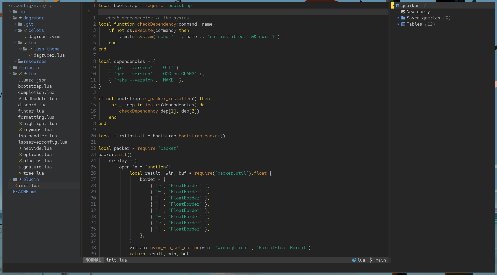

# Dagruber
Dagruber is a colorscheme inspired by [gruber-darker](https://github.com/rexim/gruber-darker-theme) and [darcula-solid](https://github.com/santos-gabriel-dario/darcula-solid.nvim).

# Installation
With [Packer](https://github.com/wbthomason/packer.nvim):
```lua
use { "deablofk/Dagruber.nvim", requires = "rktjmp/lush.nvim" }
``` 

# Screenshot

